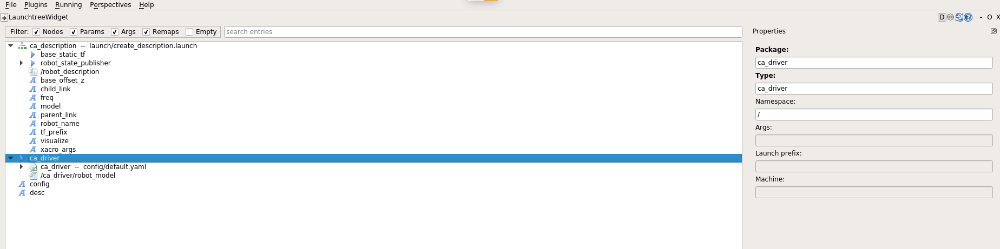

# Debugging and profiling in ROS

In this file we'll se a few issues about debugging and profiling in ROS with different tools.

## Error when trying to set breakpoints to ROS launch files with `gdb`

A common error we stumbled upon a few times was not being able to set breakpoints in the `gdb` debugger.

In the next example, we'll show what happens when we try to run `gdb` with the `send_goal.launch` launch file, from the package `ca_move_base`.
We added to the launch file the attribute `launch-prefix="xterm -e gdb --args"` for running `gdb` automatically with that launch file. The `xterm` part makes the gdb print on a new terminal.

When compiling initially with `catkin_make` alone, the terminal shows:

```console
GNU gdb (Ubuntu 7.11.1-0ubuntu1~16.5) 7.11.1
Copyright (C) 2016 Free Software Foundation, Inc.
License GPLv3+: GNU GPL version 3 or later <http://gnu.org/licenses/gpl.html>
(...)
Reading symbols from /create_ws/devel/lib/ca_move_base/send_goal...(no debugging symbols found)...done
```

This text is the normal initial printing of `gdb`, except for the "no debugging symbols found" part. This is related to the fact that we didn't compile with the `DCMAKE_BUILD_TYPE=Debug` flag. Also, the `RelWithDebInfo` flag can be used for that purpose. **What these two flags do is to compile all compilable code with associated symbols which can be later used for debugging. If they're not compiled with these symbols, `gdb` can't create breakpoints because it doesn't has a reference for creating them**. The difference between the two of them is the optimization level with which the code will be compiled with, which can cause certain bugs to [appear with one flag and not with the other](<https://cmake.org/pipermail/cmake/2001-October/002479.html>).:

```console
(gdb) b 2
No symbol table is loaded.  Use the "file" command.
```

When compiling everything again with `catkin_make -DCMAKE_BUILD_TYPE=Debug`, when trying to set breakpoints with `gdb`:

```console
GNU gdb (Ubuntu 7.11.1-0ubuntu1~16.5) 7.11.1
Copyright (C) 2016 Free Software Foundation, Inc.
License GPLv3+: GNU GPL version 3 or later <http://gnu.org/licenses/gpl.html>
(...)
Reading symbols from /create_ws/devel/lib/ca_move_base/send_goal...done.
(gdb) info variables
All defined variables:

File /create_ws/src/create_autonomy/navigation/ca_move_base/src/send_robot_goal.cpp:
static const std::__cxx11::string NODE_NAME;

File /opt/ros/kinetic/include/ros/message_event.h:
const std::__cxx11::string ros::MessageEvent<actionlib_msgs::GoalStatusArray_<std::allocator<void> > const>::s_unknown_publisher_string_;
(...)
```

We can see that now it can read all the correct symbols from our `.cpp` file, and additionaly we printed all the variables involved with the program. Let's try setting breakpoints:

```console
(gdb) break 9
Breakpoint 1 at 0x47e5f4: file /create_ws/src/create_autonomy/navigation/ca_move_base/src/send_robot_goal.cpp, line 9.
(gdb) break 11
Breakpoint 2 at 0x47e623: file /create_ws/src/create_autonomy/navigation/ca_move_base/src/send_robot_goal.cpp, line 11.
```

No problems were printed. Let's run the program and print a few variables:

```console
(gdb) r
Starting program: /create_ws/devel/lib/ca_move_base/send_goal 2 5 2 __name:=navigation_goals __log:=/home/create/.ros/log/6826bd1e-dbd3-11e9-a5bc-902b346723a7/create1-navigation_goals-1.log
[Thread debugging using libthread_db enabled]
Using host libthread_db library "/lib/x86_64-linux-gnu/libthread_db.so.1".

Breakpoint 1, __static_initialization_and_destruction_0 (__initialize_p=1, __priority=65535) at /create_ws/src/create_autonomy/navigation/ca_move_base/src/send_robot_goal.cpp:10
10      const std::string NODE_NAME = "navigation_goals";
(gdb) print NODE_NAME
$1 = ""
(gdb) backtrace
#0  __static_initialization_and_destruction_0 (__initialize_p=1, __priority=65535) at /create_ws/src/create_autonomy/navigation/ca_move_base/src/send_robot_goal.cpp:10
#1  _GLOBAL__sub_I_main () at /create_ws/src/create_autonomy/navigation/ca_move_base/src/send_robot_goal.cpp:48
#2  0x00000000004458dd in __libc_csu_init ()
#3  0x00007ffff62307bf in __libc_start_main (main=0x424510 <main(int, char**)>, argc=6, argv=0x7fffffffe168, init=0x445890 <__libc_csu_init>, fini=<optimized out>, rtld_fini=<optimized out>, stack_end=0x7fffffffe158) at ../csu/libc-start.c:247
#4  0x0000000000424df9 in _start ()
(gdb) c
Continuing.
Breakpoint 2, main (argc=6, argv=0x7fffffffe168) at /create_ws/src/create_autonomy/navigation/ca_move_base/src/send_robot_goal.cpp:12
12      int main(int argc, char** argv){
(gdb) print NODE_NAME
$2 = "navigation_goals"
```

It can be seen that the `.cpp` program was executed without any issues regarding to the use of the `gdb` program. Also, we can see that the variable 'NODE_NAME' is being defined in between the lines in which we defined the breakpoints. Additionaly, we checked the state of the stack after the first breakpoint with the `backtrace` command.

## Using Valgrind with ROS

Another well-known tool is `Valgrind`, which is used mostly for memory leaking detection and profiling. Let's see how to use it with ROS launch files.

By adding the attribute `launch-prefix="valgrind"` to a node, we will be ordering to run the node together with valgrind. [Additional parameters](<http://valgrind.org/docs/manual/manual-core.html#manual-core.basicopts>) can be provided between the quotes, for managing the amount and type of information that the tool will show.

As a brief example, we added the `Valgrind` attribute to the `calibrate.launch` file in the 'navigation' package:

```XML
<launch>
    <!-- Remap the raspicam frames -->
    <include file="$(find ca_visual_odometry)/launch/cam_mapping.launch"/>

    (...)

    <node pkg="camera_calibration" type="cameracalibrator.py" name="$(arg cam_name)_calibration" output="screen"
        args="--size $(arg chessboard_x)x$(arg chessboard_y) --square $(arg square_size_m) image:=$(arg cam_topic)" launch-prefix="valgrind"/>
</launch>

```

When running this launch file, there was a lot of output. Just as an example, here is the summay of it that appears at the end of the output:

```console
==6865== HEAP SUMMARY:
==6865==     in use at exit: 6,475,124 bytes in 14,187 blocks
==6865==   total heap usage: 121,291 allocs, 107,104 frees, 4,348,015,376 bytes allocated
==6865==
==6865== LEAK SUMMARY:
==6865==    definitely lost: 1,958 bytes in 21 blocks
==6865==    indirectly lost: 296 bytes in 5 blocks
==6865==      possibly lost: 492,966 bytes in 226 blocks
==6865==    still reachable: 5,979,904 bytes in 13,935 blocks
==6865==                       of which reachable via heuristic:
==6865==                         newarray           : 1,536 bytes in 16 blocks
==6865==         suppressed: 0 bytes in 0 blocks
==6865== Rerun with --leak-check=full to see details of leaked memory
==6865==
==6865== For counts of detected and suppressed errors, rerun with: -v
==6865== Use --track-origins=yes to see where uninitialised values come from
==6865== ERROR SUMMARY: 5494 errors from 136 contexts (suppressed: 0 from 0)
```

Let's see what this output means.

### HEAP SUMMAY

This section indicates the amount of [heap memory](<https://www.gribblelab.org/CBootCamp/7_Memory_Stack_vs_Heap.html>) used in the program. It's a useful first-check of the final state of the program, before checking in detail all the memory leaks.

### LEAK SUMMARY

- The **definitely lost** bytes indicates the amount of bytes that are leaking in the program. That is, memory that is no longer used and is not being released.
- The **indirectly lost** bytes indicates the amount of pointer-based structures that are left without memory reference, and therefore cannot be released.
- The **possibly lost** category indicates an unusual use of pointers. In some cases this can be translated into memory leak, and sometimes not.
- **Still reachable** bytes are those who could be freed at the end of the program (that is, those whose poinetrs are not lost), but haven't been freed.

For more information about how to interpret the output of this tool, [see this](<http://valgrind.org/docs/manual/quick-start.html#quick-start.interpret>) and [page 7 of this](<https://aleksander.es/data/valgrind-memcheck.pdf>).


## Launch structure

As an example, we will show how to see the launch structure of a certain launch file using the `rqt` tool. We can install the `rqt_launchtree` plugin with the command:

```console
sudo apt-get install ros-<ROS_VERSION>-rqt-launchtree
```

After installing it, we executed the `roscore` command and then the `rqt` program. Once we enter in the `rqt` program, we have to go to Plugins --> Configuration --> Launch Tree.

Here is an example of a launch structure from the `ca_tools` package:


