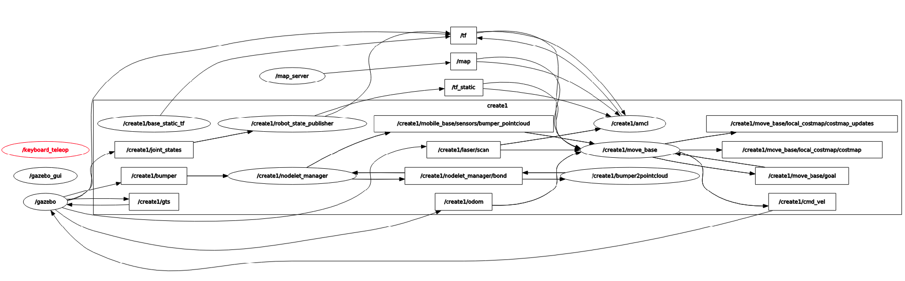
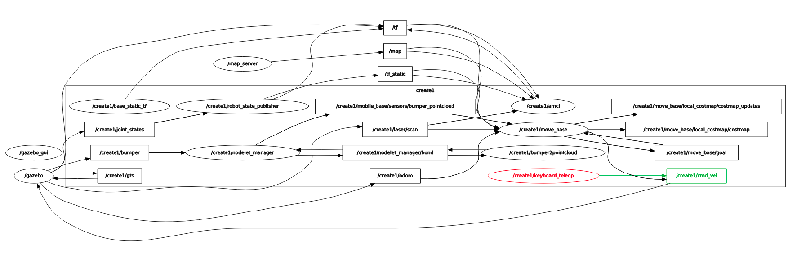
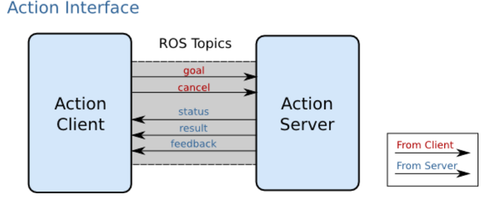

# ROS investigation for Trainee Program, 2nd week

Diverse topics were given for investigating about ROS. We're going to mention them as we move forward in this document.

## Listing namespaces

The first assignment was to list all the namespaces that exist in the current run of ROS. This was made by listing the present nodes after executing the `create_empty_world.launch` simulation and the `keyboard_teleop` tool. Also, additional utilities like `awk` and `uniq` were used for listing namespaces without repetition.
The result was:

```console
create@galatea:/create_ws$ rosnode list | awk -F "/" '{print "/"$2}' | uniq
/create1
/gazebo
/gazebo_gui
/keyboard_teleop
/map_server
/rosout
```

## Listing topics and their message types

The second was to list topics with their message types. The command executed shows both the message types for published topics and subscribed topics.

```console
create@galatea:/create_ws$ rostopic list -v

Published topics:
/map_metadata [nav_msgs/MapMetaData]
/create1/move_base/DWAPlannerROS/parameter_descriptions [dynamic_reconfigure/ConfigDescription]
/create1/move_base/local_costmap/obstacle_layer/parameter_descriptions [dynamic_reconfigure/ConfigDescription]
/create1/amcl/parameter_descriptions [dynamic_reconfigure/ConfigDescription]
/create1/front_right_cliff_sensor/scan [sensor_msgs/LaserScan]
/create1/move_base/result [move_base_msgs/MoveBaseActionResult]
/create1/odom [nav_msgs/Odometry]
/tf [tf2_msgs/TFMessage] 4 publishers
/clicked_point [geometry_msgs/PointStamped]
/create1/amcl/parameter_updates [dynamic_reconfigure/Config]
/create1/mobile_base/sensors/bumper_pointcloud [sensor_msgs/PointCloud2]
/create1/move_base/local_costmap/obstacle_layer/parameter_updates [dynamic_reconfigure/Config]
/create1/joint_states [sensor_msgs/JointState]
/create1/move_base/local_costmap/footprint [geometry_msgs/PolygonStamped]
/create1/move_base/parameter_updates [dynamic_reconfigure/Config]
/create1/move_base/local_costmap/costmap [nav_msgs/OccupancyGrid]
/create1/gts [nav_msgs/Odometry]
/create1/move_base/current_goal [geometry_msgs/PoseStamped]
/create1/cmd_vel [geometry_msgs/Twist]
/gazebo_gui/parameter_descriptions [dynamic_reconfigure/ConfigDescription]
/create1/move_base/global_costmap/inflation_layer/parameter_updates [dynamic_reconfigure/Config]
/create1/particlecloud [geometry_msgs/PoseArray]
/create1/move_base/DWAPlannerROS/trajectory_cloud [sensor_msgs/PointCloud2]
/create1/move_base/feedback [move_base_msgs/MoveBaseActionFeedback]
/gazebo_gui/parameter_updates [dynamic_reconfigure/Config]
/tf_static [tf2_msgs/TFMessage]
/create1/side_left_cliff_sensor/scan [sensor_msgs/LaserScan]
/gazebo/parameter_descriptions [dynamic_reconfigure/ConfigDescription]
/create1/move_base/DWAPlannerROS/global_plan [nav_msgs/Path]
/map [nav_msgs/OccupancyGrid]
/create1/side_right_cliff_sensor/scan [sensor_msgs/LaserScan]
/create1/move_base/local_costmap/inflation_layer/parameter_descriptions [dynamic_reconfigure/ConfigDescription]
/create1/move_base/global_costmap/obstacle_layer/parameter_updates [dynamic_reconfigure/Config]
/create1/move_base/global_costmap/footprint [geometry_msgs/PolygonStamped]
/create1/move_base/local_costmap/parameter_updates [dynamic_reconfigure/Config]
/create1/move_base/global_costmap/static_layer/parameter_updates [dynamic_reconfigure/Config]
/wall_sensor/scan [sensor_msgs/LaserScan]
/create1/move_base/local_costmap/parameter_descriptions [dynamic_reconfigure/ConfigDescription]
/create1/move_base/global_costmap/costmap [nav_msgs/OccupancyGrid]
/create1/move_base/global_costmap/inflation_layer/parameter_descriptions [dynamic_reconfigure/ConfigDescription]
/rosout [rosgraph_msgs/Log] 11 publishers
/create1/move_base/local_costmap/costmap_updates [map_msgs/OccupancyGridUpdate]
/create1/raspicam/parameter_descriptions [dynamic_reconfigure/ConfigDescription]
/create1/move_base/global_costmap/parameter_updates [dynamic_reconfigure/Config]
/initialpose [geometry_msgs/PoseWithCovarianceStamped]
/move_base_simple/goal [geometry_msgs/PoseStamped]
/rosout_agg [rosgraph_msgs/Log]
/create1/move_base/local_costmap/inflation_layer/parameter_updates [dynamic_reconfigure/Config]
/create1/imu/data [sensor_msgs/Imu]
/create1/nodelet_manager/bond [bond/Status] 2 publishers
/create1/move_base/global_costmap/costmap_updates [map_msgs/OccupancyGridUpdate]
/create1/front_left_cliff_sensor/scan [sensor_msgs/LaserScan]
/create1/raspicam/camera_info [sensor_msgs/CameraInfo]
/create1/move_base/DWAPlannerROS/parameter_updates [dynamic_reconfigure/Config]
/create1/move_base/DWAPlannerROS/cost_cloud [sensor_msgs/PointCloud2]
/create1/move_base/parameter_descriptions [dynamic_reconfigure/ConfigDescription]
/create1/move_base/goal [move_base_msgs/MoveBaseActionGoal]
/create1/amcl_pose [geometry_msgs/PoseWithCovarianceStamped]
/create1/bumper [ca_msgs/Bumper]
/gazebo/link_states [gazebo_msgs/LinkStates]
/create1/raspicam/parameter_updates [dynamic_reconfigure/Config]
/create1/move_base/global_costmap/parameter_descriptions [dynamic_reconfigure/ConfigDescription]
/cmd_vel [geometry_msgs/Twist]
/gazebo/model_states [gazebo_msgs/ModelStates]
/clock [rosgraph_msgs/Clock]
/create1/move_base/NavfnROS/plan [nav_msgs/Path]
/create1/raspicam/image_raw [sensor_msgs/Image]
/create1/move_base/global_costmap/obstacle_layer/parameter_descriptions [dynamic_reconfigure/ConfigDescription]
/create1/laser/scan [sensor_msgs/LaserScan]
/create1/move_base/status [actionlib_msgs/GoalStatusArray]
/create1/move_base/global_costmap/static_layer/parameter_descriptions [dynamic_reconfigure/ConfigDescription]
/create1/move_base/DWAPlannerROS/local_plan [nav_msgs/Path]
/gazebo/parameter_updates [dynamic_reconfigure/Config]


Subscribed topics:
 /create1/move_base/cancel [actionlib_msgs/GoalID]
 /create1/move_base/local_costmap/footprint [geometry_msgs/PolygonStamped]
 /gazebo/set_link_state [gazebo_msgs/LinkState]
 /tf [tf2_msgs/TFMessage] 3 subscribers
 /create1/move_base_simple/goal [geometry_msgs/PoseStamped]
 /create1/mobile_base/sensors/bumper_pointcloud [sensor_msgs/PointCloud2]
 /create1/joint_states [sensor_msgs/JointState]
 /create1/cmd_vel [geometry_msgs/Twist]
 /create1/move_base/local_costmap/costmap_updates [map_msgs/OccupancyGridUpdate]
 /create2/move_base/local_costmap/costmap_updates [map_msgs/OccupancyGridUpdate]
 /tf_static [tf2_msgs/TFMessage] 3 subscribers
 /create1/move_base/global_costmap/footprint [geometry_msgs/PolygonStamped]
 /map_updates [map_msgs/OccupancyGridUpdate]
 /map [nav_msgs/OccupancyGrid] 3 subscribers
 /rosout [rosgraph_msgs/Log]
 /create1/gts [nav_msgs/Odometry]
 /create1/initialpose [geometry_msgs/PoseWithCovarianceStamped]
 /create1/odom [nav_msgs/Odometry]
 /create1/nodelet_manager/bond [bond/Status] 2 subscribers
 /gazebo/set_model_state [gazebo_msgs/ModelState]
 /create1/move_base/goal [move_base_msgs/MoveBaseActionGoal]
 /create1/cliff [ca_msgs/Cliff]
 /create2/move_base/local_costmap/costmap [nav_msgs/OccupancyGrid]
 /clock [rosgraph_msgs/Clock] 12 subscribers
 /create1/move_base/local_costmap/costmap [nav_msgs/OccupancyGrid]
 /create1/bumper [ca_msgs/Bumper]
 /create1/laser/scan [sensor_msgs/LaserScan]
```

As it can be seen, every message type has two fields which are separated by a forward slash character. The one before the forward slash corresponds to the package which defines the message, and the one after it corresponds to the name of the message itself.

## Listening to a specific topic

This assignment was completed by executing the command `rostopic echo /create1/cmd_vel`, which corresponds to the topic that has information about the angular and linear velocity of the simulated robot. Simultaneously with the printing made by this command, the robot was being moved with the `keyboard_teleop` tool. The result was:

```console
create@galatea:/create_ws$ rostopic echo /create1/cmd_vel
linear:
  x: 0.0
  y: 0.0
  z: 0.0
angular:
  x: 0.0
  y: 0.0
  z: 0.0
---
linear:
  x: 0.3
  y: 0.0
  z: 0.0
angular:
  x: 0.0
  y: 0.0
  z: 0.0
---
linear:
  x: 0.3
  y: 0.0
  z: 0.0
angular:
  x: 0.0
  y: 0.0
  z: -0.8
```

## Using rqt_graph with a quick comment about the 'Multi-robot setup (#76)' commit

The commit mentioned in the last title added another feature to the package which allows controlling multiple robot in one simulation. This creates a bug related to the namespaces of the different robots and the `keyboard_teleop` tool. This tool sends directly messages to the `cmd_vel` topic, but this topic doesn't exist. The `cmd_vel` topic that is available is `/create1/cmd_vel`
This can be seen in the following image:



We can see that only the `/create1/` namespace exists, because there is only one robot in the simulation. Also, we can see that the `keyboard_teleop` node is not connected to any other node, because it is publishing to a topic that no other node is subscribed to. That is, the `keyboard_teleop` tool created a topic that has no subscribers.

If we execute the `keyboard_teleop` tool with the command:

```console
roslaunch ca_tools keyboard_teleop.launch __ns:=/create1/
```

Then the following graph is created:



We can see that now the `keyboard_teleop'` node is included in the `/create1/` namespace and is communicated with other nodes which are subscribed or to the `/create1/cmd_vel` topic.

## ROS services

Services are a another type of communication between nodes which works in a slighlty different way than the publish/subscribe paradigm. The two entities that participate in the services are called **Server** and **Client**.
As opposed to the publish/subscribe paradigm which creates topics that exist indefinitely and which don't need a transmitter and a reciever for existing (only one of them), this kind of communication is based on a request/reply exchange of messages. Once the request has been replied (which means that the service requested has been provided), the communication ends. This means it's a one-time communication.
In the file system level, services have their own folder in the package. In this folder you can define the reply and request data types with `.srv` files.
__persistent connection__

### Displaying and listing information about services

There are two ROS command regarding services information. One of them is `rosservice`, which provides all sorts of information regarding services that are currently online. The other one is `rossrv`, which provides information about the `.srv` files.

For displaying all the list of services available in a ROS session, the command `rosservice list` can be executed. Executing it in the `create_empty_world` simulation prints the following text:

```console
create@galatea:/create_ws$ rosservice list
/create1/amcl/get_loggers
/create1/amcl/set_logger_level
/create1/amcl/set_parameters
/create1/base_static_tf/get_loggers
/create1/base_static_tf/set_logger_level
/create1/bumper2pointcloud/get_loggers
/create1/bumper2pointcloud/set_logger_level
/create1/global_localization
/create1/imu/is_calibrated
/create1/move_base/DWAPlannerROS/set_parameters
/create1/move_base/NavfnROS/make_plan
/create1/move_base/clear_costmaps
/create1/move_base/get_loggers
/create1/move_base/global_costmap/inflation_layer/set_parameters
/create1/move_base/global_costmap/obstacle_layer/set_parameters
/create1/move_base/global_costmap/set_parameters
/create1/move_base/global_costmap/static_layer/set_parameters
/create1/move_base/local_costmap/inflation_layer/set_parameters
/create1/move_base/local_costmap/obstacle_layer/set_parameters
/create1/move_base/local_costmap/set_parameters
(...)
/gazebo/get_model_properties
/gazebo/get_model_state
/gazebo/get_physics_properties
/gazebo/get_world_properties
/gazebo/pause_physics
/gazebo/reset_simulation
/gazebo/reset_world
/gazebo/set_joint_properties
/gazebo/set_light_properties
/gazebo/set_link_properties
/gazebo/set_link_state
/gazebo/set_logger_level
/gazebo/set_model_configuration
/gazebo/set_model_state
/gazebo/set_parameters
/gazebo/set_physics_properties
/gazebo/spawn_sdf_model
/gazebo/spawn_urdf_model
/gazebo/unpause_physics
/gazebo_gui/get_loggers
/gazebo_gui/set_logger_level
/gazebo_gui/set_parameters
/map_server/get_loggers
/map_server/set_logger_level
/rosout/get_loggers
/rosout/set_logger_level
/static_map
```

For displaying the services that are included in a package, the command `rossrv package`can be used. For example:

```console
create@galatea:/opt/ros/kinetic/share/gazebo_msgs/srv$ rossrv package gazebo_msgs 
gazebo_msgs/ApplyBodyWrench
gazebo_msgs/ApplyJointEffort
gazebo_msgs/BodyRequest
gazebo_msgs/DeleteLight
gazebo_msgs/DeleteModel
gazebo_msgs/GetJointProperties
gazebo_msgs/GetLightProperties
gazebo_msgs/GetLinkProperties
gazebo_msgs/GetLinkState
gazebo_msgs/GetModelProperties
gazebo_msgs/GetModelState
gazebo_msgs/GetPhysicsProperties
gazebo_msgs/GetWorldProperties
gazebo_msgs/JointRequest
gazebo_msgs/SetJointProperties
gazebo_msgs/SetJointTrajectory
gazebo_msgs/SetLightProperties
gazebo_msgs/SetLinkProperties
gazebo_msgs/SetLinkState
gazebo_msgs/SetModelConfiguration
gazebo_msgs/SetModelState
gazebo_msgs/SetPhysicsProperties
gazebo_msgs/SpawnModel
create@galatea:/opt/ros/kinetic/share/gazebo_msgs/srv$ 
```

## ROS actions

There can be cases where a service can take too long, so maybe in those cases the user will want to end them before they can process all the information that they need to process, or will want to see what is the state of the request. So for those cases, the actions were created.
Similar to the services, actions have **ActionClients** which request the actions and **ActionServers** which provide the reply for the requests. As opposed to services, the communication between nodes in an action is called "ROS Action Protocol", which is a process that is delivered by ROS messages. 

This process has three messages that define it:

- **Goal**, which tells the ActionServer the goal to achieve with the action.
- **Feedback**, which allows the ActionServer to tell the ActionClient about the progression of the action. It is sent periodically.
- **Result**, which is sent by the time the action is completed.

These messages are defined in a `.action` file. In addition to these, there are two more messages which can be sent when the action protocol takes place. These are:

- **Cancel**, which is used to send cancel requests to the ActionServer.
- **Status**, which is used to inform ActionClients about the current state of every goal in the system.



### Listing actions in a ROS session

Actions, as opposed to services or messages, don't have a dedicated native ROS command for listing them, such as `rosservice list`. So we can use the `grep` utility for finding active actions.

The result was the following:

```console
create@galatea:/create_ws$ rostopic list | grep 'feedback'
/create1/move_base/feedback
create@galatea:/create_ws$ rostopic list | grep 'cancel'
/create1/move_base/cancel
create@galatea:/create_ws$ rostopic list | grep 'status'
/create1/move_base/status
create@galatea:/create_ws$ rostopic list | grep 'result'
\/create1/move_base/result
create@galatea:/create_ws$ rostopic list | grep 'goal'
/create1/move_base/current_goal
/create1/move_base/goal
/create1/move_base_simple/goal
/move_base_simple/goal
```

As it can be seen, there is an active action in the `move_base` namespace, which has the five topics which correspond to an active action.

#### Additional note

Last's section printing was made with the [`Multi-robot setup (#76)`](<https://github.com/RoboticaUtnFrba/create_autonomy/commit/0e97acd69e40ef7137d0c3af3909fcafc60b3e64>) commit as the last commit. When pulled the [`AMCL improvements for presentation at UTN (#95)`](<https://github.com/RoboticaUtnFrba/create_autonomy/commit/632800507c21e0afa804c9b1385d6eb0e8c4e662>) commit, the action no longer appeared.
