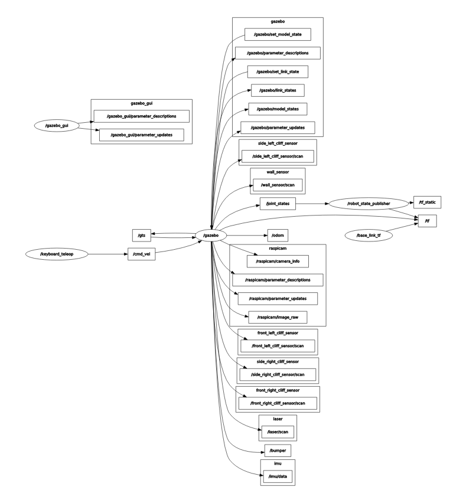

# ROS

## ROS namespaces

Namespaces in ROS provide a hierarchical naming structure used for all resources in ROS Computation.

Every resource is defined within a namespace and can create another resource within their namespace, this provides encapsulation and is a way to avoid taking information wrongfully because of a conflicting name.

ROS nodes are programmed like they are all in the top-level namespace, and when you want to apply them into a larger system you can assign them a namespace that represents what that collection of codes is all about.
 

### Valid Names

1. First character is an alpha character ([a-z|A-Z]), tilde (~) or forward slash (/)
2. Subsequent characters can be alphanumeric ([0-9|a-z|A-Z]), underscores (_), or forward slashes (/) 

*Exception:* base names (described below) cannot have forward slashes (/) or tildes (~) in them. 

### Resolving

There are four types of Graph Resource Names in ROS: base, relative, global, and private, which have the following syntax:

* base
* relative/name
* /global/name
* ~private/name 

By default, resolution is done relative to the node's namespace. For example, the node /wg/node1 has the namespace /wg, so the name node2 will resolve to /wg/node2.

Names with no namespace qualifiers whatsoever are base names. Base names are actually a subclass of relative names and have the same resolution rules. Base names are most frequently used to initialize the node name.

Names that start with a "/" are global -- they are considered fully resolved. Global names should be avoided as much as possible as they limit code portability.

Names that start with a "~" are private. They convert the node's name into a namespace. For example, node1 in namespace /wg/ has the private namespace /wg/node1. Private names are useful for passing parameters to a specific node via the parameter server. 

## Quick Overview of Graph Concepts

* Nodes: A node is an executable that uses ROS to communicate with other nodes.
* Messages: ROS data type used when subscribing or publishing to a topic.
* Topics: Nodes can publish messages to a topic as well as subscribe to a topic to receive messages.
* Master: Name service for ROS (i.e. helps nodes find each other)
* rosout: ROS equivalent of stdout/stderr
* roscore:Master + rosout + parameter server , you have to execute roscore first in order to be capable of runing nodes 


## Client Libraries

ROS client libraries allow nodes written in different programming languages to communicate:

* rospy = python client library
* roscpp = c++ client library 

## Using rosrun (How to run a node)

rosrun allows you to use the package name to directly run a node within a package (without having to know the package path).

Usage:

`rosrun [package_name] [node_name]`

You can also run a node from a `launch` file.

## rostopic command line

The rostopic command-line tool displays information about ROS topics. Currently, it can display a list of active topics, the publishers and subscribers of a specific topic, the publishing rate of a topic, the bandwidth of a topic, and messages published to a topic. The display of messages is configurable to output in a plotting-friendly format. 

## Using rostopic list (How to list topics)

Using `rostopic list` we get a list of all the active topics

Ex.

```
/bumper
/clock
/cmd_vel
/front_left_cliff_sensor/scan
/front_right_cliff_sensor/scan
/gazebo/link_states
/gazebo/model_states
/gazebo/parameter_descriptions
/gazebo/parameter_updates
/gazebo/set_link_state
/gazebo/set_model_state
/gazebo_gui/parameter_descriptions
/gazebo_gui/parameter_updates
/gts
/imu/data
/joint_states
/laser/scan
/odom
/raspicam/camera_info
/raspicam/image_raw
/raspicam/parameter_descriptions
/raspicam/parameter_updates
/rosout
/rosout_agg
/side_left_cliff_sensor/scan
/side_right_cliff_sensor/scan
/tf
/tf_static
/wall_sensor/scan
```

## rostopic echo (How to listen to topics)

rostopic echo shows the data published on a topic.

Usage: 

`rostopic echo [topic]`

Ex.

```
header: 
  seq: 219741
  stamp: 
    secs: 5493
    nsecs: 551000000
  frame_id: ''
name: [right_wheel_joint, left_wheel_joint]
position: [0.00021267155264759197, -0.0007811901056760107]
velocity: []
effort: []
---
```

Which is a message of the topic `/joint_states`

## ROS messages

ROS uses a simplified message description language to describe the data values that ROS
nodes publish. With this description, ROS can generate the right source code for these types
of messages in several programming languages.

## Using rostopic type(How to see the type of a topic)

rostopic type returns the message type of any topic being published.

Usage:

`rostopic type [topic]`

Try:

`rostopic type /joint_states`

You should get:

`sensor_msgs/JointState`

# Putting in practice

# 1. Run the simulation

We run the simulation with the following command:

`roslaunch ca_gazebo create_house.launch`

# 2. List the namespaces that exist

Because we use the namespaces in different elements like nodes, topics, etc, we would be listing them individually

# Nodes

Using the follwing command:

`rosnode list`

and the result is

```
/base_link_tf
/gazebo
/gazebo_gui
/robot_state_publisher
/rosout
```
# Topics

Using the follwing command:

`rostopic list`

and the result is

```
/bumper
/clock
/cmd_vel
/front_left_cliff_sensor/scan
/front_right_cliff_sensor/scan
/gazebo/link_states
/gazebo/model_states
/gazebo/parameter_descriptions
/gazebo/parameter_updates
/gazebo/set_link_state
/gazebo/set_model_state
/gazebo_gui/parameter_descriptions
/gazebo_gui/parameter_updates
/gts
/imu/data
/joint_states
/laser/scan
/odom
/raspicam/camera_info
/raspicam/image_raw
/raspicam/parameter_descriptions
/raspicam/parameter_updates
/rosout
/rosout_agg
/side_left_cliff_sensor/scan
/side_right_cliff_sensor/scan
/tf
/tf_static
/wall_sensor/scan
```
# Parameter Server

using the following command:

`rosparam list`

and the result is:

```
/gazebo/auto_disable_bodies
/gazebo/cfm
/gazebo/contact_max_correcting_vel
/gazebo/contact_surface_layer
/gazebo/erp
/gazebo/gravity_x
/gazebo/gravity_y
/gazebo/gravity_z
/gazebo/max_contacts
/gazebo/max_update_rate
/gazebo/sor_pgs_iters
/gazebo/sor_pgs_precon_iters
/gazebo/sor_pgs_rms_error_tol
/gazebo/sor_pgs_w
/gazebo/time_step
/gazebo_gui/auto_disable_bodies
/gazebo_gui/cfm
/gazebo_gui/contact_max_correcting_vel
/gazebo_gui/contact_surface_layer
/gazebo_gui/erp
/gazebo_gui/gravity_x
/gazebo_gui/gravity_y
/gazebo_gui/gravity_z
/gazebo_gui/max_contacts
/gazebo_gui/max_update_rate
/gazebo_gui/sor_pgs_iters
/gazebo_gui/sor_pgs_precon_iters
/gazebo_gui/sor_pgs_rms_error_tol
/gazebo_gui/sor_pgs_w
/gazebo_gui/time_step
/raspicam/imager_rate
/robot_description
/rosdistro
/roslaunch/uris/host_localhost__35543
/roslaunch/uris/host_localhost__37709
/roslaunch/uris/host_localhost__45505
/rosversion
/run_id
/use_sim_time
```

# Services

using the follwing command:

`$ rosservice list`

and the result is:

```
/base_link_tf/get_loggers
/base_link_tf/set_logger_level
/gazebo/apply_body_wrench
/gazebo/apply_joint_effort
/gazebo/clear_body_wrenches
/gazebo/clear_joint_forces
/gazebo/delete_light
/gazebo/delete_model
/gazebo/get_joint_properties
/gazebo/get_light_properties
/gazebo/get_link_properties
/gazebo/get_link_state
/gazebo/get_loggers
/gazebo/get_model_properties
/gazebo/get_model_state
/gazebo/get_physics_properties
/gazebo/get_world_properties
/gazebo/pause_physics
/gazebo/reset_simulation
/gazebo/reset_world
/gazebo/set_joint_properties
/gazebo/set_light_properties
/gazebo/set_link_properties
/gazebo/set_link_state
/gazebo/set_logger_level
/gazebo/set_model_configuration
/gazebo/set_model_state
/gazebo/set_parameters
/gazebo/set_physics_properties
/gazebo/spawn_sdf_model
/gazebo/spawn_urdf_model
/gazebo/unpause_physics
/gazebo_gui/get_loggers
/gazebo_gui/set_logger_level
/gazebo_gui/set_parameters
/imu/is_calibrated
/keyboard_teleop/get_loggers
/keyboard_teleop/set_logger_level
/raspicam/set_camera_info
/raspicam/set_parameters
/robot_state_publisher/get_loggers
/robot_state_publisher/set_logger_level
/rosout/get_loggers
/rosout/set_logger_level
```

In general we observe that even if they are different elements (nodes and topics for example) they share some of the namespaces.


# 3. Run the teleop

We launch the teleop using the following command:

`roslaunch ca_tools keyboard_teleop.launch`

# 4. List all the topics and their message type

To get all the information in one, we would use the following command:

`rostopic list -v`

This displays a verbose list of topics to publish to and subscribe to and their type. 

and the result is:
```
Published topics:
 * /raspicam/image_raw [sensor_msgs/Image] 1 publisher
 * /raspicam/parameter_descriptions [dynamic_reconfigure/ConfigDescription] 1 publisher
 * /front_right_cliff_sensor/scan [sensor_msgs/LaserScan] 1 publisher
 * /raspicam/parameter_updates [dynamic_reconfigure/Config] 1 publisher
 * /rosout_agg [rosgraph_msgs/Log] 1 publisher
 * /odom [nav_msgs/Odometry] 1 publisher
 * /raspicam/camera_info [sensor_msgs/CameraInfo] 1 publisher
 * /side_left_cliff_sensor/scan [sensor_msgs/LaserScan] 1 publisher
 * /gazebo_gui/parameter_updates [dynamic_reconfigure/Config] 1 publisher
 * /tf_static [tf2_msgs/TFMessage] 1 publisher
 * /gazebo/parameter_descriptions [dynamic_reconfigure/ConfigDescription] 1 publisher
 * /cmd_vel [geometry_msgs/Twist] 1 publisher
 * /wall_sensor/scan [sensor_msgs/LaserScan] 1 publisher
 * /rosout [rosgraph_msgs/Log] 5 publishers
 * /joint_states [sensor_msgs/JointState] 1 publisher
 * /imu/data [sensor_msgs/Imu] 1 publisher
 * /laser/scan [sensor_msgs/LaserScan] 1 publisher
 * /front_left_cliff_sensor/scan [sensor_msgs/LaserScan] 1 publisher
 * /tf [tf2_msgs/TFMessage] 3 publishers
 * /gazebo_gui/parameter_descriptions [dynamic_reconfigure/ConfigDescription] 1 publisher
 * /side_right_cliff_sensor/scan [sensor_msgs/LaserScan] 1 publisher
 * /gts [nav_msgs/Odometry] 1 publisher
 * /gazebo/link_states [gazebo_msgs/LinkStates] 1 publisher
 * /gazebo/model_states [gazebo_msgs/ModelStates] 1 publisher
 * /clock [rosgraph_msgs/Clock] 1 publisher
 * /bumper [ca_msgs/Bumper] 1 publisher
 * /gazebo/parameter_updates [dynamic_reconfigure/Config] 1 publisher

Subscribed topics:
 * /gazebo/set_model_state [gazebo_msgs/ModelState] 1 subscriber
 * /gazebo/set_link_state [gazebo_msgs/LinkState] 1 subscriber
 * /gts [nav_msgs/Odometry] 1 subscriber
 * /joint_states [sensor_msgs/JointState] 1 subscriber
 * /rosout [rosgraph_msgs/Log] 1 subscriber
 * /clock [rosgraph_msgs/Clock] 5 subscribers
 * /cmd_vel [geometry_msgs/Twist] 1 subscriber

```

# 5. Listen to a specific topic

We would choose the topic `/wall_sensor/scan` 

To listen to we would use the following command:

`$ rostopic echo /wall_sensor/scan`

the result is:
```
---
header: 
  seq: 144
  stamp: 
    secs: 2948
    nsecs: 352000000
  frame_id: "wall_sensor_link"
angle_min: 0.0
angle_max: 0.0
angle_increment: nan
time_increment: 0.0
scan_time: 0.0
range_min: 0.01600000076
range_max: 0.0399999991059
ranges: [0.02430526539683342]
intensities: [0.0]
---
header: 
  seq: 145
  stamp: 
    secs: 2948
    nsecs: 402000000
  frame_id: "wall_sensor_link"
angle_min: 0.0
angle_max: 0.0
angle_increment: nan
time_increment: 0.0
scan_time: 0.0
range_min: 0.01600000076
range_max: 0.0399999991059
ranges: [0.02430526539683342]
intensities: [0.0]
---

```

Which is updated on the screen at the frequency the `topic` is published.

# rqt_graph



As we can see, we have 5 nodes active, which are the ones that we found when running `rosnode list`.

The nodes `/gazebo_gui` and `/base_link_tf` are not publishing or subscribing to other nodes, so they don't send any messages.

The node `/keyboard_teleop`  is publishing the message `/cmd_vel`.

The node `/gazebo` is subscribed to the topic `/cmd_vel`, is subscribed and publish the topic `/gts` and is publishing the topic `/joint_states`.

The node `/robot_state_publisher` is subscribed to the topic `/joint_states`.

So what we understand with this graph is that the commands you input in the `/keyboard_teleop` send a message of velocity.

The node `/gazebo` receives that message because is subscribed to that topic, and produce movement in the simulation, this affects the odometry and joint states, the odometry changes are reflected in the `/gts` topic and the joint states in the `/joint_states`.

Finally the node `/robot_state_publisher` is subscribed to the `/joint_states` topic so now have the information about what changed in the simulation.

# Services

Services are another way in which nodes communicate with each other, allowing nodes to send a request and receive a response.

For a Service to work, it needs a `Client` that send a request and a `Server` to answer it.

Services are defined by a *srv* file, and like topics, are associated with a service type, consisting in `package name + the name of the .srv file`

Ex. `/gazebo/spawn_urdf_model`

# Service Structure

A service description file consists of a request and a response msg type, separated by '---'.

```
string str
---
string str
```

# Rosservice

Rosservice is the command-line tool that would help us to interact with services, typing `rosservice -h` we get the following:

```
Commands:
        rosservice args print service arguments
        rosservice call call the service with the provided args
        rosservice find find services by service type
        rosservice info print information about service
        rosservice list list active services
        rosservice type print service type
        rosservice uri  print service ROSRPC uri

Type rosservice <command> -h for more detailed usage, e.g. 'rosservice call -h'

```
We would choose the service `/gazebo/reset_world` to test some of these commands.

First, we want some info about the service, so we use `rosservice info /gazebo/reset_world` to see what we can find out:

```
Node: /gazebo
URI: rosrpc://localhost:36603
Type: std_srvs/Empty
Args: 
```

The result provides the node in which this service is implemented (`/gazebo`), the identification of the service (`rosrpc://localhost:36603`), the type (`std_srvs/Empty`) and if receives any argument.

We also could see the type by using the command `rosservice type /gazebo/reset_world`.

We conclude that this service is implemented in the node `/gazebo`, his type is `std_srvs/empty` so it doesn't receive any argument when called.

Next, we are going to try if this service works, we would do that by watching the default of the topics `/gts` that would tell us the initial position of the robot.

```
header: 
  seq: 451587
  stamp: 
    secs: 7676
    nsecs: 997000000
  frame_id: "map"
child_frame_id: "base_link"
pose: 
  pose: 
    position: 
      x: -2.99984854403
      y: 0.999967610922
      z: 0.0199955617801
    orientation: 
      x: 6.5531857653e-07
      y: 0.0076754636961
      z: -6.68300686921e-05
      w: 0.999970540961
  covariance: [0.0, 0.0, 0.0, 0.0, 0.0, 0.0, 0.0, 0.0, 0.0, 0.0, 0.0, 0.0, 0.0, 0.0, 0.0, 0.0, 0.0, 0.0, 0.0, 0.0, 0.0, 0.0, 0.0, 0.0, 0.0, 0.0, 0.0, 0.0, 0.0, 0.0, 0.0, 0.0, 0.0, 0.0, 0.0, 0.0]
twist: 
  twist: 
    linear: 
      x: 4.21094835555e-06
      y: -6.01972076044e-09
      z: 2.73699073022e-05
    angular: 
      x: -1.50153416371e-06
      y: 0.000210587602451
      z: 3.01321622084e-07
  covariance: [0.0, 0.0, 0.0, 0.0, 0.0, 0.0, 0.0, 0.0, 0.0, 0.0, 0.0, 0.0, 0.0, 0.0, 0.0, 0.0, 0.0, 0.0, 0.0, 0.0, 0.0, 0.0, 0.0, 0.0, 0.0, 0.0, 0.0, 0.0, 0.0, 0.0, 0.0, 0.0, 0.0, 0.0, 0.0, 0.0]
---
```

Then we are going to move it using the `keyboard_teleop` and see what changes in `/gts` after some movement.

After the movement, this is what `/gts` tell us:
```
header: 
  seq: 483769
  stamp: 
    secs: 8224
    nsecs:  91000000
  frame_id: "map"
child_frame_id: "base_link"
pose: 
  pose: 
    position: 
      x: 0.551938579533
      y: 0.594366406152
      z: 0.0199955012947
    orientation: 
      x: -0.000953408729255
      y: 0.00761729611452
      z: 0.12421624513
      w: 0.992225474505
  covariance: [0.0, 0.0, 0.0, 0.0, 0.0, 0.0, 0.0, 0.0, 0.0, 0.0, 0.0, 0.0, 0.0, 0.0, 0.0, 0.0, 0.0, 0.0, 0.0, 0.0, 0.0, 0.0, 0.0, 0.0, 0.0, 0.0, 0.0, 0.0, 0.0, 0.0, 0.0, 0.0, 0.0, 0.0, 0.0, 0.0]
twist: 
  twist: 
    linear: 
      x: 3.82122206624e-05
      y: 9.38518186139e-06
      z: -8.36008964565e-05
    angular: 
      x: -0.000530636928772
      y: 0.00204281079925
      z: -3.97403132859e-05
  covariance: [0.0, 0.0, 0.0, 0.0, 0.0, 0.0, 0.0, 0.0, 0.0, 0.0, 0.0, 0.0, 0.0, 0.0, 0.0, 0.0, 0.0, 0.0, 0.0, 0.0, 0.0, 0.0, 0.0, 0.0, 0.0, 0.0, 0.0, 0.0, 0.0, 0.0, 0.0, 0.0, 0.0, 0.0, 0.0, 0.0]
```

Now we are going to call the service `/gazebo/reset_world` using the following:

`rosservice call /gazebo/reset_world`

After that, we check what message the topic `/gts` is sending:

`rostopic echo /gts`

and the result is:
```
header: 
  seq: 495917
  stamp: 
    secs: 8430
    nsecs: 607000000
  frame_id: "map"
child_frame_id: "base_link"
pose: 
  pose: 
    position: 
      x: -2.9997565431
      y: 0.999311876628
      z: 0.0199955616229
    orientation: 
      x: 4.5706296405e-06
      y: 0.00767546175958
      z: -0.000570436713555
      w: 0.999970380495
  covariance: [0.0, 0.0, 0.0, 0.0, 0.0, 0.0, 0.0, 0.0, 0.0, 0.0, 0.0, 0.0, 0.0, 0.0, 0.0, 0.0, 0.0, 0.0, 0.0, 0.0, 0.0, 0.0, 0.0, 0.0, 0.0, 0.0, 0.0, 0.0, 0.0, 0.0, 0.0, 0.0, 0.0, 0.0, 0.0, 0.0]
twist: 
  twist: 
    linear: 
      x: 4.21090985167e-06
      y: -2.61461978715e-08
      z: 2.73698704598e-05
    angular: 
      x: -1.29365337995e-06
      y: 0.000210588731809
      z: 4.25104851609e-07
  covariance: [0.0, 0.0, 0.0, 0.0, 0.0, 0.0, 0.0, 0.0, 0.0, 0.0, 0.0, 0.0, 0.0, 0.0, 0.0, 0.0, 0.0, 0.0, 0.0, 0.0, 0.0, 0.0, 0.0, 0.0, 0.0, 0.0, 0.0, 0.0, 0.0, 0.0, 0.0, 0.0, 0.0, 0.0, 0.0, 0.0]
---
```
We observe that the robot was back to is original position, so we conclude that what the service `/gazebo/reset_world` do is reset the robot, getting him back to the spawn position.

# Actions

Actions are very similar to Servers in the sense that they are both sending a request and receiving a response, the difference resides in the fact that Servers didn't show the progress of the task nor the task can be canceled, when you use a Server you expect that the process would be finished quickly.

Actions, on the other hand, are useful when a task may take a significant length of time, allowing you to track the progress of the request, get the outcome or cancel the request.

# Client-Server Interaction

The *ActionClient* and *ActionServer* communicate via a 'ROS ACTION PROTOCOL', providing a simple API to request goals or execute goals via function calls and callbacks.

For the communication to work, are defined Goal, Feedback and Result messages:

## Goal

A goal is information send by the ActionClient to the ActionServer so the server knows what is the goal to achieve it, in the case of robot movement can be a pose message.

## Feedback

Feedback provides the ActionServer a way to inform the ActionClient about the progress that has been made to accomplish the goal, in the case robot movement can be the actual position of the robot.

## Result

The result is sent from the ActionServer, and is only sent once. Sometimes the message itself is not that important but just a way to inform that the progress was finished.  

# Action Structure

The .action file has the goal definition, followed by the result definition, followed by the feedback definition, with each section separated by 3 hyphens (---). 

```
# Define the goal
uint32 dishwasher_id  # Specify which dishwasher we want to use
---
# Define the result
uint32 total_dishes_cleaned
---
# Define a feedback message
float32 percent_complete
```

## Aditional Investigation

### ROS COMMUNICATION

### Master and communication between nodes

The master is implemented via XMLRPC, chose because is relatively lightweight and has availability in a variety of programming languages.

Have registrations APIS(application program interface) which is what allows nodes to register as publishers, subscribers and service providers.

The master allows the nodes to communicate to each other serving as some sort of guide to let the nodes "notice" each other.

Then the communication between nodes is done by peer-to-peer.

# SOURCE:

[http://wiki.ros.org/Names](http://wiki.ros.org/Names)

[http://wiki.ros.org/rostopic](http://wiki.ros.org/rostopic)

[http://wiki.ros.org/ROS/Tutorials/UnderstandingTopics](http://wiki.ros.org/ROS/Tutorials/UnderstandingTopics)

[http://wiki.ros.org/ROS/Technical%20Overview](http://wiki.ros.org/ROS/Technical%20Overview)

[http://wiki.ros.org/Services](http://wiki.ros.org/Services)

[http://wiki.ros.org/actionlib/Tutorials](http://wiki.ros.org/actionlib/Tutorials)

[http://design.ros2.org/articles/actions.html](http://design.ros2.org/articles/actions.html)
