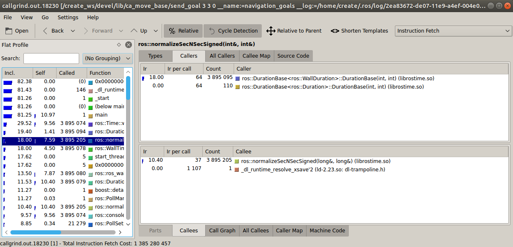
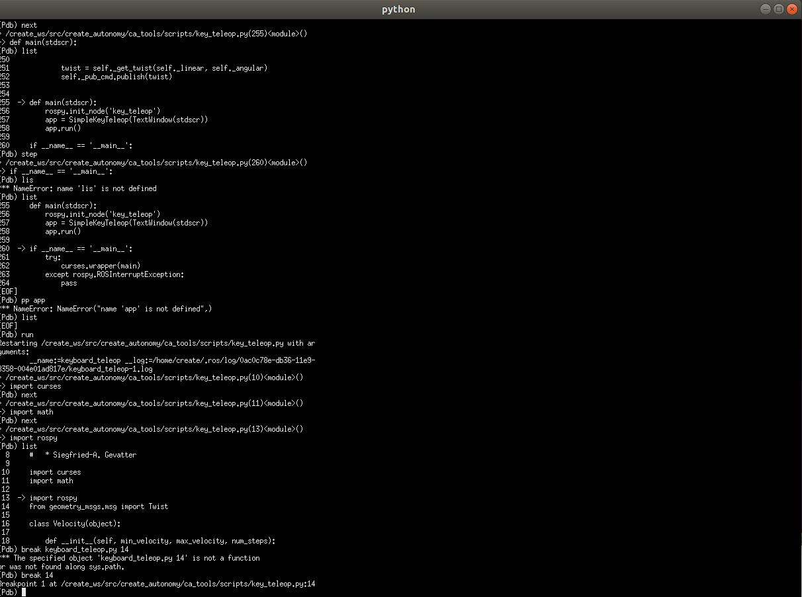
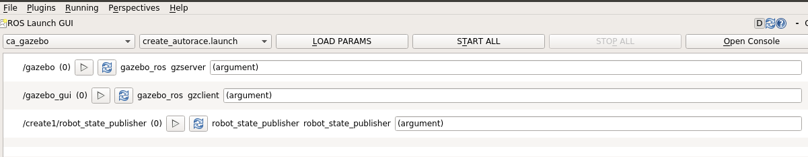

# Week 3 Notes

# Master

## How to run master node from terminal

The command to run the master node from a terminal is:

`roscore`

## rosrun


rosrun is a command from the rosbash package that allows you to run a single node from a package without needing to give it's full path or cd/roscd there first.

Usage 

`rosrun <package> <executable>`

Ex.

`rosrun ca_tools key_teleop.py`

## roslaunch

roslaunch is a package that allows you to run multiple nodes locally and remotely via SSH, as well as setting on the Parameter Server.

It takes one or more XML configuration files (with the .launch extension) that specify the parameters to set and the nodes to launch, as well as the machines that they should be run on.

Ex. 

`roslaunch ca_gazebo create_house.launch`

## Difference between rosrun and roslaunch commands

The main difference is that rosrun can only run one node at the time, and also need the master to be initialized (with `roscore`).

roslaunch, on the other hand, takes an XML file that has all the information about what nodes to launch, so it can launch multiples nodes at once and also automatically runs the master if it is not already running.

## How launch files are organized in the project?

### create_autonomy

In the project create_autonomy, the launch files are organized in the packages in which they are implemented, so If a package needs to include another launch file in their XML configuration, it uses a command to find that package path to do a proper call to the launch file that would be added.

### turtlebot

In the project turtlebot, also the launch files are organized in the respective packages, the difference resides in that, if a launch file need to include another one, the included launch file  is on a folder called "include" in the same folder as the original launch file, also the format of the file is `.launch.xml`, different from the `.launch` original.

## Profiling and debugging tools?

### Valgrind

The Valgrind tool suite provides several debugging and profiling tools. Nothing from the original gets run directly on the host processor, instead, works this way:

A program translated the code into a temporary simpler form, called Intermediate Representation (IR), after that, a tool (Memcheck for example), can implement changes on the code and introduced its commands to do the necessary tests, after the changes, Valgrind recompiles binary coded to run on a host and other simulated CPUs to execute, and the tool that you are using offers the feedback with the results of the tests.

#### Profiling a node with valgrind while launching ROS

We can attach the diagnosis tool to the node in the launch file adding the following line to the launch file:

`launch-prefix="valgrind"`

Memcheck is the default tool you get when using Valgrind, you can add `--leak-check=yes` to obtain more detailed information about the tests.

To use another tool you the syntax is to add `--tool=<toolname>`.

Some of these tools are:

* memcheck (used by default if you don't put any `--tool`): a memory error detector.
* cachegrind: a cache and branch-prediction profiler.
* callgrind: a call=graph generating cache profiler.
* helgrind: a thread error detector.
* drd: another thread error detector.

All of these tools provide a different type of output so you have to be knowledgable in how to interpret the results.

Ex.

```
  <node pkg="ca_move_base" type="send_goal" name="navigation_goals" 
        args="$(arg x) $(arg y) $(arg Y)" ns="$(arg ns)" launch-prefix="valgrind"/>
</launch>
  ```

### Example of profiling with Valgrind

First of all, we need to install the tools that would help us to analyze this node, these are, valgrind to do the profiling, and kchegrind and graphviz to represent them in a graphical interface:

`sudo apt-get install valgrind kcachegrind graphviz`

For this example we are going to use the node `send_goal` of the package `ca_move_base` to do the profiling, we proceed to change the launch file to execute the tool.

```
<launch>
  <arg name="x"/>
  <arg name="y"/>
  <arg name="Y"/>

  <arg name="ns"/>

  <node pkg="ca_move_base" type="send_goal" name="navigation_goals" 
        args="$(arg x) $(arg y) $(arg Y)" ns="$(arg ns)" launch-prefix="valgrind --tool=callgrind"/>
</launch>

```

So we execute the following command to launch the node:

`roslaunch ca_move_base send_goal.launch ns:=send_goal x:="3" y:="3" Y:="0"`

After finishing the execution, the data collected is stored in a `callgrind.out.XXX` file, where "XXX" will be the process identifier, this file is created in the `.ros/` folder.

You can read this file using a text editor, but the report is cryptic and hard to understand, so instead we are going to use `Kchegrind` to help us to interpret the result of the tests.

So we see that the process identifier[pid] in this case is `27866`, so now we need to open the file generated, for that, we use the following code:

```
cd ~/.ros/
kcachegrind callgrind.out.27866
```

This will open kchegrind and we now can analyze the results of our previous test.

On the left we have a list of profiled functions, with the inclusive and the self cost of each function and the location of each one.

Clicking on a function displays us with more information in the form of tabs, these are:

* Types: the types of events that have been recorded
* Callers: List of the direct callers
* All Callers: List of all the callers
* Callee Map: A map of the callee
* Source Code: The source code of the function if the application has been compiled.

As we see, the graphic interface of Kcachegrind facilitates the interpretation of the logs generated by Callgrind, making it easy for us the process of profiling a node.



*The pid number is different because the screenshot was taken in another session*

### gbd 

GDB stands for GNU Project Debugger and is a powerful debugging tool for C (along with other languages like C++).
It allows you to go inside your program while executing, so you how the program is behaving step by step and also know if it crashed the reason for that.

#### Attaching a node to GDB while launching ROS

We can attach the debugging tools of gdb by modifying the launch file in the following way:

`launch-prefix="xterm -e gdb --args"`

Ex.

```
<launch>
  <arg name="x"/>
  <arg name="y"/>
  <arg name="Y"/>

  <arg name="ns"/>

  <node pkg="ca_move_base" type="send_goal" name="navigation_goals" 
        args="$(arg x) $(arg y) $(arg Y)" ns="$(arg ns)" launch-prefix="xterm -e gdb --args"/>
</launch>
```

With this launch prefix, a new xterm terminal will be created with the node attached to gdb.

### Example of debugging a c++ node with gdb

First of all, we need to install gdb in order to debug the node, we can accomplish this by using the following code:

`sudo apt-get install gdb`

For this example, we are going to debug the node `send_goal` of the `ca_move_base` package.

So we go to the launch file `send_goal.launch` and add the launch prefix so we can run gdb with roslaunch:

```
<launch>
  <arg name="x"/>
  <arg name="y"/>
  <arg name="Y"/>

  <arg name="ns"/>

  <node pkg="ca_move_base" type="send_goal" name="navigation_goals" 
        args="$(arg x) $(arg y) $(arg Y)" ns="$(arg ns)" launch-prefix="xterm -e gdb --args"/>
</launch>

```
So now when we launch the node, it also would launch gdb on a xterm, so we are going to do that, launching with arbitrary arguments for testing:

`roslaunch ca_move_base send_goal.launch ns:=send_goal x:=3.0  y:=3.0 Y:=0.0`

After that we get the gdb tool running on a xterm, because the prefix we use, to run the program we have to type `r` or `run`, but first we can use some of the other commands that would help us to debug.

The first command we are going to see is `break`, which allows us to put a *breakpoint* and stop the execution of the program in a certain line.

For this example we would put a `break` in the main file by using `break main`, but we can also break in any line of the code using "break number", for example, `break 151`.

So we set a breakpoint at main and the run the node.

And as we expected, the program stops at the break point, we can list the current breakpoints using `info breakpoints`.

We can additionally clear breakpoints with the `clear` command, and enable or disable breakpoints with `enable` and `disable` addressing the breakpoint by his number.

Once we stopped the execution on the breakpoint, we can do a few things, first we going to see the command `next`, what this command does is moves you to the next statement in the current function (or returns to the function's caller if you've stepped off the end of the function.)

Since we don't have any other breakpoint we get to the final loop of the program, in this case, the attempt to connect to the move_base action server, so now we going to quit the program and start another breakpoint to check the variables.

We are going to set a new breakpoint to see the value of a variable, but first we delete the previous breakpoint with the command `clear main`, after that we are going to aim at the line 10 witch contains the const `NODE_NAME` (we are going to use in this case a constant but its main use is to check variable values in the correspondent line)

So we set our new breakpoint by using `break 10`, and run the program again, once it stops in the breakpoint, we use the following command to see the value of `NODE_NAME`:

`disp/s NODE_NAME`

And we get the value `"navigation_goals"`, we set the format of the output by using the `/s` and obtain a string as an output, manipulating this value you can obtain the output in different formats such as int or hexadecimal.

As we show this are the basic movements to start debugging a node in C++, for more commands to use in `gdb` you can see them [here](http://www.yolinux.com/TUTORIALS/GDB-Commands.html).

Since we can't copy what happened in the gdb xterm, a photo that illustrates how the process looks:


### Example of debugging a python node with pdb

pdb is the debugger for python that is included in the standard python library, since that library is already used in our create_autonomy repo, we don't need to install anything.

To run pdb in the node we add the prefix `launch-prefix="xterm -e python -m pdb"` in the launch file to execute the pdb on an xterm.

So the file would end up being like this:
```
<launch>
  <node pkg="ca_tools" type="key_teleop.py" name="keyboard_teleop" output="screen" launch-prefix="xterm -e python -m pdb"/>
</launch>
```

Launching that with roslaunch would open the xterm with pdb, and now we can begin to debug.

After launching we get in the xterm the pdb, now we are going to use some commands to do the proper debugging.

The first command we are going to see is `list`, using `list` loads the first lines of the code so you can have a quick scope on the file you are going to debug.

In the xterm, we see these characters `->`. which are used to identify in which line we are right now.

We can continue to run the program using `step` or `next`, The difference is that `step` will stop within a called function, while `next` executes called functions to only stop at the next line of the current function. 

Other thing we can do is put a breakpoint, we do that using the `break` command, followed by the number of the line in which we are going to put the breakpoint:

`break 14`

Those are some of the basics tools to debug in pdb, you can also integrate pdb into the program code by editing the file, for more information and a table of utilities you can visit the following page:

[https://www.digitalocean.com/community/tutorials/how-to-use-the-python-debugger](https://www.digitalocean.com/community/tutorials/how-to-use-the-python-debugger)

As an example, this is how the xterm of `pdb` looks:



## rqt_launch

rqt_launch is an rqt plugin that allows you to see and easy way to view nodes and also to run or end nodes individually.

To run it, first you enter in rqt using on the console:

`rqt` 

After that, you select the `Launch(Experimental)` option in the Plugin tab.



We select the package with the first tab and the launch file to analyze in the second one.

We also have the option of loading parameters with the `LOAD PARAMS` option, and also to start all the nodes with the `START ALL` option.

Also is worth pointing out that when using `rqt_launch` and `START ALL`, the nodes are executed in order, different from `roslaunch` were due to loading times the first node may be not loaded, yet the second one is already running.

In the screen below we see the nodes, where we can run the nodes individually, also we can pass arguments if necessary.

As we see, rqt_launch is a really useful tool that helps us to see how the launch file behaves and to analyze the actions of specific nodes.

# Source


[https://www.geeksforgeeks.org/gdb-step-by-step-introduction/](https://www.geeksforgeeks.org/gdb-step-by-step-introduction/)

[http://wiki.ros.org/rqt](http://wiki.ros.org/rqt)

[beej.us/guide/bggdb/](beej.us/guide/bggdb/)

[https://bluesat.com.au/a-dummys-guide-to-debugging-ros-systems/](https://bluesat.com.au/a-dummys-guide-to-debugging-ros-systems/)

[http://valgrind.org/docs/manual/quick-start.html/](http://valgrind.org/docs/manual/quick-start.html/)