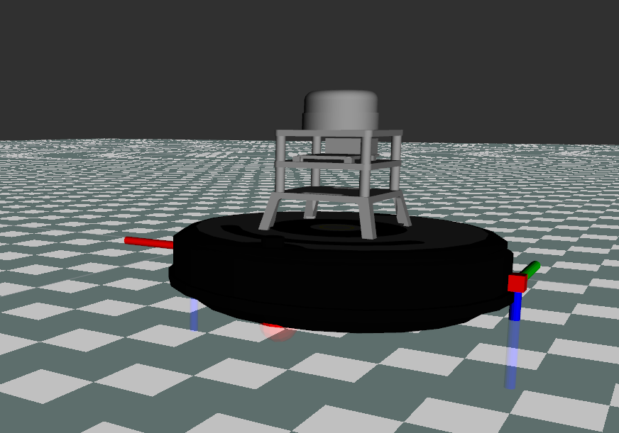

# Week 4 Notes

## URDF

URDF (Unified Robot Description Format) is an XML format that is used to describe a robot, its joints, dimensions and so on.

URDF files tend to be long and repeat themselves very often, so to make modeling easier, Xacro is introduced.

## Xacro

Xacro (short for XML Macro) is a format that allows us to write URDF files easily, making it easier to read and maintain.

The main use is to avoid repetition using macros, this reduces the file more, and to use in a simulation, you transform the file from `.xacro` to `.urdf`.

### Other utilities from xacro are:

* Load another macros by using `<xacro:include/>` 
* Declaring constants with `<xacro:property name="" value=""/>` and using them with the tag `${<name>}`
* Using math, the operations allowed are the four basic ( + , - , * , / ), the unitary minus, and the parenthesis.

### Ex.

```xml
<?xml version="1.0" ?>
<robot xmlns:xacro="http://ros.org/wiki/xacro">

<xacro:macro name="imu_sensor" params="name *origin">

  <xacro:include filename="$(find ca_description)/urdf/common_properties.xacro"/>
  <xacro:include filename="$(find ca_description)/urdf/sensors/imu_sensor_gazebo.xacro"/>

  <xacro:property name="parent_link" value="base_link"/>
  <xacro:property name="link_name" value="${name}_link"/>

  <joint name="${name}_joint" type="fixed">
    <xacro:insert_block name="origin" />
    <parent link="${parent_link}" />
    <child link="${link_name}" />
  </joint>

  <link name="${link_name}">
    <xacro:dummy_inertia/>
  </link>

  <xacro:imu_sensor_gazebo name="${name}" link_name="${link_name}"/>

</xacro:macro>

</robot>
```

## Making a Xacro file for a color sensor

To use a color sensor to use in the Gazebo simulation, we would create a new xacro and modify the one that create the model in the simulation.

First, we create our sensor, in this case, we put in the URDF folder the file `color_sensor.xacro`, that contains the following:

```xml
<?xml version="1.0" ?>
<robot xmlns:xacro="http://ros.org/wiki/xacro">

<xacro:property name="size_z" value="0.07"/>


<xacro:macro name="c_sensor" params="prefix side">
 <joint name="${prefix}_c_joint" type="fixed">
    <origin xyz="0 ${side/2} ${size_z/2}" rpy="0 ${pi/2} 0" />
    <parent link="base_link" />
    <child link="${prefix}_c_link" />
  </joint>


  <link name="${prefix}_c_link">
    <xacro:dummy_inertia/>
    <visual>
        <origin xyz="0 0 0" rpy="0 0 0"/>
        <geometry>
           <box size="0.015 0.015 0.015"/>
        </geometry>
      </visual>
  </link>
</xacro:macro>

<xacro:macro name="c_optical_frame" params="prefix">
 <joint name="${prefix}_c_optical" type="fixed">
    <origin xyz="0 0 0" rpy="${pi*3/2} 0 ${pi*3/2}" />
    <parent link="${prefix}_c_link" />
    <child link="${prefix}_c_optical_link" />
  </joint>

  <link name="${prefix}_c_optical_link">
    <xacro:dummy_inertia/>
  </link>

</xacro:macro>  

</robot>
```

The idea is to create two frames, one that is a square box to represent the visual, attached to the robot model, and the other one that is for the sensor itself and do the sensing process.

The first frame is the `c_sensor` macro, receives two arguments, `prefix` tell us if the sensor would be spawned to the `right` or `left`, in order to name the components, and `size` is how far from the center of the robot it would be spawned the sensor (in the `y` axis), is positive for left and negative for right.


```xml
 <joint name="${prefix}_c_joint" type="fixed">
    <origin xyz="0 ${side/2} ${size_z/2}" rpy="0 ${pi/2} 0" />
    <parent link="base_link" />
    <child link="${prefix}_c_link" />
  </joint>
  ```

  The joint creation is created in order to have a point to attach the sensor to the model, is `fixed` because the sensor has no movement, the origin values are to put the sensor above the robot model, and in each sides, so for the left sensor would be `prefix="left" side="${diameter/2}"` and for the right sensor `prefix="right" side="${-diameter/2}"`.

  The parent link is a part of the `create` robot, and the child is the link we just created bellow.

```xml
   <link name="${prefix}_c_link">
    <xacro:dummy_inertia/>
    <visual>
        <origin xyz="0 0 0" rpy="0 0 0"/>
        <geometry>
           <box size="0.015 0.015 0.015"/>
        </geometry>
      </visual>
  </link>
</xacro:macro>
```

For the link part, we also use `prefix` to name it, and use values for another xacro for the inertial values, in `<visual>` we set if the design is offset with the joint values in the `<origin>` values, in this case, they are in the same point.

In the `<geometry>` part we represent the visuals of the model, for this sensor we represent it with just a simple box.

Now for the second joint, that would serve as the optical frame in which we would program the plugin, we have:

```xml
 <joint name="${prefix}_c_optical" type="fixed">
    <origin xyz="0 0 0" rpy="${pi*3/2} 0 ${pi*3/2}" />
    <parent link="${prefix}_c_link" />
    <child link="${prefix}_c_optical_link" />
  </joint>
  ```

  The joint values, in this case, the parent is the link created previously, and the child is the link created bellow, so it basically would be in the same place as the first joint, the `rpy` values are to put the axis according to the [REP](https://www.ros.org/reps/rep-0103.html).

  As for the link part:

```xml
  <link name="${prefix}_c_optical_link">
    <xacro:dummy_inertia/>
  </link>
  ```

  We don't have visual representation for this frame, only some inertial values.

  We modified the `create_base.xacro` file of the package to implement these models in the simulation by adding:

  ```xml
    <xacro:c_sensor prefix="left" side="${diameter}"/>
    <xacro:c_optical_frame prefix="left"/>
    <xacro:c_sensor prefix="right" side="${-diameter}"/>
    <xacro:c_optical_frame prefix="right"/>
```

So now when we spawn the robot we can see our changes and the new links added:

