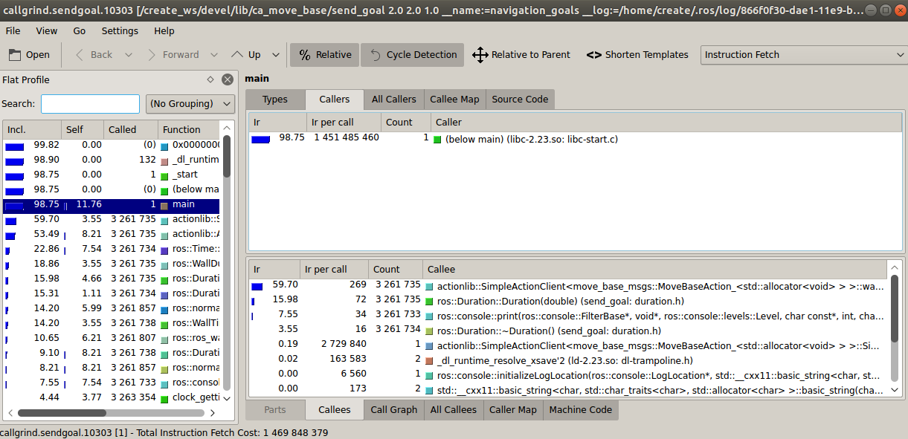
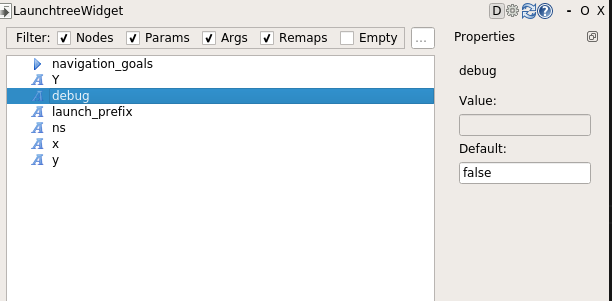
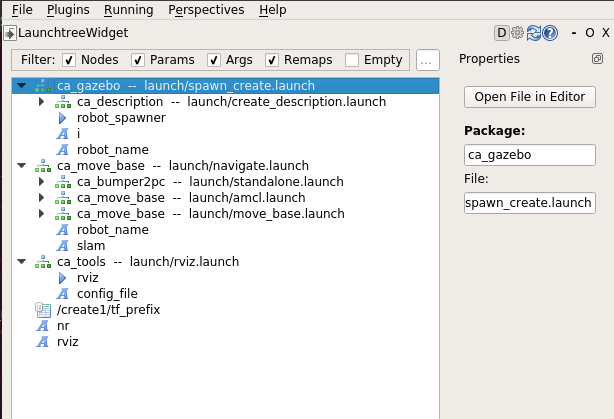

# Debug and profiling notes

The whole document is based on [this note](http://wiki.ros.org/roslaunch/Tutorials/Roslaunch%20Nodes%20in%20Valgrind%20or%20GDB), so you can check it first.
To be able to follow the examples, install valgrind and callgrind.

## Using Valgrind for profiling

[This other article](http://wiki.ros.org/roslaunch/Tutorials/Profiling%20roslaunch%20nodes) talks about profiling.
We'll use the [create_autonomy](https://github.com/RoboticaUtnFrba/create_autonomy) repo, in order to make some examples.

First, we open the docker launchfile, [see here](https://github.com/RoboticaUtnFrba/create_autonomy/wiki/Setup-Docker), then we stall `valgrind` and `kcachegrind`, we will make use of that later. `sudo apt-get install valgrind callgrind -y`

Then, we compile our project, `catkin_make DCMAKE_BUILD_TYPE=Debug`.
Then, we source devel/setup.bash `source devel/setup.bash`
Now, we will decide which node to profile, in our case `send_goal`, a node located in `ca_move_base` pkg.
In order to profile that node, we have to include a `launch-prefix` tag, into the desired `node` tag into the `launch file`.
So, to locate the launchfile `roscd ca_move_base/launch`.
We can edit the `send_goal.launch` file with whatever editor we feel like.

This is how my `send_goal.launch` looked like after the changes I made.
    
    <launch>
        <arg name="debug" default="false"/>
        <arg name="x" default="2.0"/>
        <arg name="y" default="2.0"/>
        <arg name="Y" default="1.0"/>
        <arg name="ns" default="create1"/>
        <arg unless="$(arg debug)" name="launch_prefix" value=""/>
        <arg if="$(arg debug)" name="launch_prefix" value="valgrind --tool=callgrind --callgrind-out-file='callgrind.sendgoal.%p'"/>
        <node pkg="ca_move_base" type="send_goal" name="navigation_goals"
        args="$(arg x) $(arg y) $(arg Y)" ns="$(arg ns)" launch-prefix="$(arg launch_prefix)"/>
    </launch>

Note I added some default values to the required arguments, only to make the usage of the launchfile more straight-forward.
We can launch now the file with `roslaunch ca_move_base send_goal.launch debug:=true`, we can let it run a little and then `C-c` to stop it.
Valgrind will automatically create a log located in `~/.ros/`, let's check it:
    
    cd ~/.ros/
    ls

Now to analyze the info we will use `kcachegrind`, so `vallgrind` measures the info and `kcachegrind` analyzes it.
Then we can open it with `kcachegrind`, that we installed earlier.

    
    kcachegrind callgrind.sendgoal.10303
*The appended number may vary with the PID associated.*

Now a window shows up, with a lot of info of the program, if you want to deepen more on the topic, you can see [here](http://valgrind.org/docs/), and learn how to interpret the data.
For example, the field `Self` means the time that the program was in the function itself, and the field `Called` measures the time that the program spent on the functions that were called inside the function.

## Debugging with gdb

To install gdb: `sudo apt-get install gdb`.
The process is pretty similar to the previous case, but in this one, the `launch-prefix` differs a little, let's see:

We have some options depending on how we want to launch gdb, in my case, I chose the *run your node in a gdb in a separate xterm window, manually type run to start it* way.
So, we have to change the launch prefix of `send_goal` to match with the info on the wiki page.
This is how my `send_goal.launch` file looks like:

    <launch>
        <arg name="debug" default="false"/>
        <arg name="x" default="2.0"/>
        <arg name="y" default="2.0"/>
        <arg name="Y" default="1.0"/>
        <arg name="ns" default="create1"/>
        <arg unless="$(arg debug)" name="launch_prefix" value=""/>
        <arg if="$(arg debug)" name="launch_prefix" value="xterm -e gdb --args"/>
        <node pkg="ca_move_base" type="send_goal" name="navigation_goals"
        args="$(arg x) $(arg y) $(arg Y)" ns="$(arg ns)" launch-prefix="$(arg launch_prefix)"/>
    </launch>

We can launch now the file with `roslaunch ca_move_base send_goal.launch debug:=true`, and a `xterm` window will popup.
We can now use every functionality that `gdb` offers, I recommend seeing [this cheatsheet](https://darkdust.net/files/GDB%20Cheat%20Sheet.pdf) for some useful commands.

Let's see a quick example, first set a setpoint at line 10 of the file, `b 10`.
The output:

    Breakpoint 1 at 0x47ee62: file /create_ws/src/create_autonomy/navigation/ca_move_base/src/send_robot_goal.cpp, line 10.
    (gdb) 

Then run the program with `run`.
We can see the program stopped at the checkpoint we set previously.

    Breakpoint 1, __static_initialization_and_destruction_0 (__initialize_p=1, 
        __priority=65535)
        at /create_ws/src/create_autonomy/navigation/ca_move_base/src/send_robot_goal.cpp:10
    10      const std::string NODE_NAME = "navigation_goals";

Now if we use `where full`:

    #0  __static_initialization_and_destruction_0 (__initialize_p=1, 
        __priority=65535)
        at /create_ws/src/create_autonomy/navigation/ca_move_base/src/send_robot_goal.cpp:10
    No locals.
    #1  0x000000000047ef7d in _GLOBAL__sub_I_main ()
        at /create_ws/src/create_autonomy/navigation/ca_move_base/src/send_robot_goal.cpp:48
    No locals.
    #2  0x00000000004b649d in __libc_csu_init ()
    No symbol table info available.
    #3  0x00007ffff62307bf in __libc_start_main (
        main=0x47e426 <main(int, char**)>, argc=6, argv=0x7fffffffe168, 
        init=0x4b6450 <__libc_csu_init>, fini=<optimized out>, 
        rtld_fini=<optimized out>, stack_end=0x7fffffffe158)
        at ../csu/libc-start.c:247
            result = <optimized out>
            unwind_buf = {cancel_jmp_buf = {{jmp_buf = {0, 0, 0, 0, 0, 0, 0, 0}, 
                mask_was_saved = 0}}, priv = {pad = {0x0, 0x7fffffffe168, 
                0x7fffffffe1a0, 0x7ffff7ffe168}, data = {prev = 0x0, 
                cleanup = 0x7fffffffe168, canceltype = -7776}}}
            not_first_call = <optimized out>
    #4  0x000000000047e359 in _start ()

We could watch a variable with `watch`, and many more features.

## Debugging a python node with pdb

First install the required tools:

    sudo apt-get install python-dbg libpython-dbg
    sudo apt-get update

Same last case but with a python node, in this case we'll be debugging `keyboard_teleop` node, from `ca_tools` pkg.
So, `roscd ca_tools/launch`, and edit `keyboard_teleop.launch` to match mine:

    <!-- USE MOVE_ROBOT VARIABLE TO SELECT WHICH ROBOT TO CONTROL, DEFAULT=1 -->
    <launch>
        <arg name="ID" default="$(optenv ID 1)"/>
        <node pkg="ca_tools" type="key_teleop.py" name="keyboard_teleop" output="screen" ns="$(eval 'create' + str(arg('ID')))" if="$(eval arg('ID') > 0)" launch-prefix="xterm -e python -m pdb" />
    </launch>

Now we can launch the launchfile, `roslaunch ca_tools keyboard_teleop.launch`, and now we get the xterm window with `pdb`, and we can use all it's functionalities.
You can check this [pdb cheatsheet](https://appletree.or.kr/quick_reference_cards/Python/Python%20Debugger%20Cheatsheet.pdf)

Same example than before: `b 10`
Output:

    Breakpoint 1 at /create_ws/src/create_autonomy/ca_tools/scripts/key_teleop.py:10

`run`

    >/create_ws/src/create_autonomy/ca_tools/scripts/key_teleop.py(10)<module>()
    -> import curses
    (Pdb) 

### Launch structure

In order to adress last changes requested, added the `send_goal` launch structure.

If you want to replicate this graph, you have to install `rqt_launchtree` first.

    sudo apt-get install ros-kinetic-rqt-launchtree

And then `rqt`.

Then `plugins->Configurations->Launch tree`.
Now you can pick any launchfile you like, and then inspect it as you please.

We can see the graph shows the `debug` *argument* added previously.

We can check a more complex launchfile, let's see `spawn_multirobot.launch`

We can see it launches several launchfiles.
