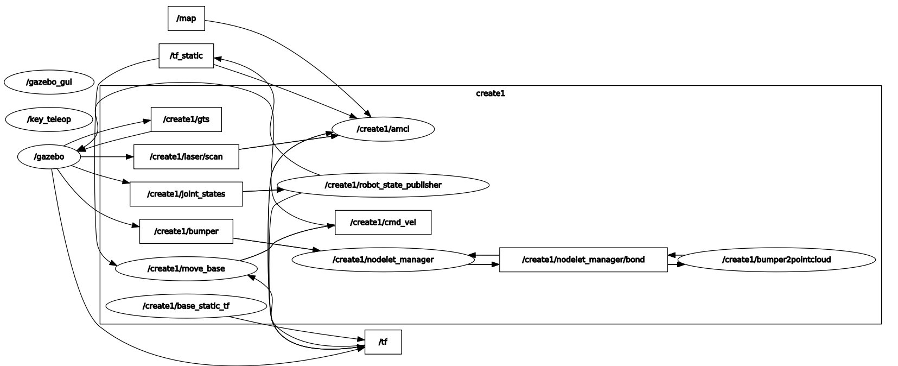
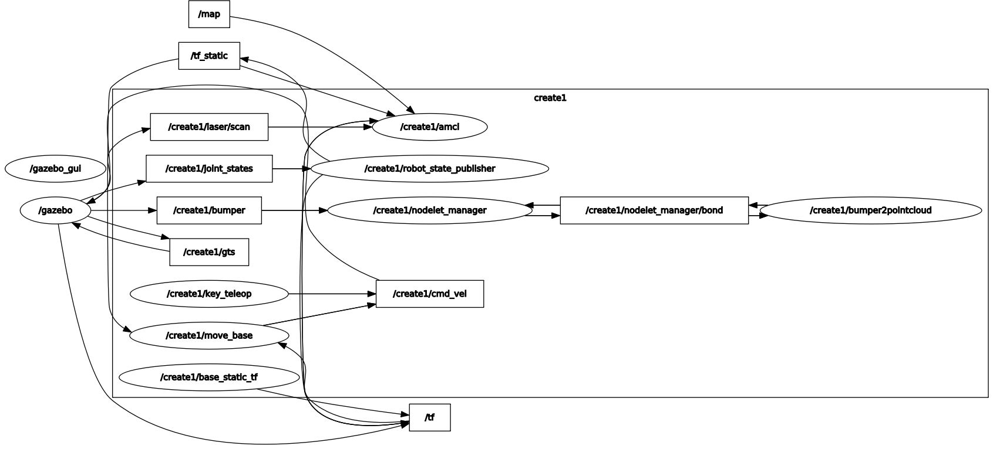

# Trainee program Week#2 notes

After running the docker container, building with catkin, and launching `roslaunch ca_gazebo create_empty_world.launch`, we see gazebo launching and spawning a robot.

We can list the topics with `rostopic list`, only showing some:

    ...
    /𝗰𝗿𝗲𝗮𝘁𝗲𝟭/𝗰𝗺𝗱_𝘃𝗲𝗹
    /create1/laser/scan
    /create1/mobile_base/sensors/bumper_pointcloud
    /create1/move_base/current_goal
    /create1/move_base/goal
    /create1/move_base/local_costmap/costmap
    /create1/move_base/local_costmap/costmap_updates
    /create1/move_base_simple/goal
    /create1/nodelet_manager/bond
    /create1/odom
    /create2/move_base/local_costmap/costmap_updates
    ...
Now we launch the teleop script, `roslaunch ca_tools key_teleop.py`, but we can't move the turtle, let's check the `rostopic list` again:

    ... 
    /create1/amcl/parameter_descriptions
    /create1/amcl/parameter_updates
    /create1/amcl_pose
    /create1/bumper
    /create1/cliff
    /𝗰𝗿𝗲𝗮𝘁𝗲𝟭/𝗰𝗺𝗱_𝘃𝗲𝗹
    /create1/front_left_cliff_sensor/scan
    /𝗰𝗺𝗱_𝘃𝗲𝗹
    ...

We can see there're 2 cmd_vel topics, let's check which one is being published on:

`rostopic echo /cmd_vel`:

    ...
    linear: 
    x: 0.0
    y: 0.0
    z: 0.0
    angular: 
    x: 0.0
    y: 0.0
    z: 0.0
    ---
    linear: 
    x: 0.0
    y: 0.0
    z: 0.0
    angular: 
    x: 0.0
    y: 0.0
    z: 0.0
    ...

`rostopic echo /create1/cmd_vel`:

    **nothing**

We can go even further and check with `rqt_graph`, let's see.

We can see `/key_teleop` node that's not publishing on the right topic.

And, we can check the namespaces, ros doesn't have a command that shows them straight up, but you can list them with `rosnode list | awk -F "/" '{print "/"$2}' | uniq`:

    /create1
    /gazebo
    /gazebo_gui
    /rosout

So, it seems the multirobot feature Emi added, changes the robot's default namespace; *Dammit, Emi!*

We can specify a namespace when running a script, `rosrun ca_tools key_teleop.py __ns:=/create1/`

Now we can check with `rqt_graph`:

We can see `/create1/key_teleop` is now publishing to the correct topic, `/create1/cmd_vel` are connected now! And we can move the turtle, great!

## Let's check some topic msg types

`rostopic list -v`

    ...
    /create1/move_base/current_goal [geometry_msgs/PoseStamped]
    /create1/imu/data [sensor_msgs/Imu] 1 
    /gazebo_gui/parameter_descriptions [dynamic_reconfigure/ConfigDescription]
    /create1/particlecloud [geometry_msgs/PoseArray]
    /gazebo_gui/parameter_updates [dynamic_reconfigure/Config]
    /tf_static [tf2_msgs/TFMessage]
    /create1/side_left_cliff_sensor/scan [sensor_msgs/LaserScan]
    /gazebo/parameter_descriptions [dynamic_reconfigure/ConfigDescription] 
    /create1/cmd_vel [geometry_msgs/Twist]
    /rosout [rosgraph_msgs/Log]
    /create1/raspicam/parameter_descriptions [dynamic_reconfigure/ConfigDescription]
    /initialpose [geometry_msgs/PoseWithCovarianceStamped]
    /move_base_simple/goal [geometry_msgs/PoseStamped]
    /rosout_agg [rosgraph_msgs/Log]
    /create1/odom [nav_msgs/Odometry]
    /create1/nodelet_manager/bond [bond/Status]
    ...

And, you can go deeper inside the messages, to see how are they composed `rosmsg show geometry_msgs/Twist`:

    geometry_msgs/Vector3 linear
    float64 x
    float64 y
    float64 z
    geometry_msgs/Vector3 angular
    float64 x
    float64 y
    float64 z
